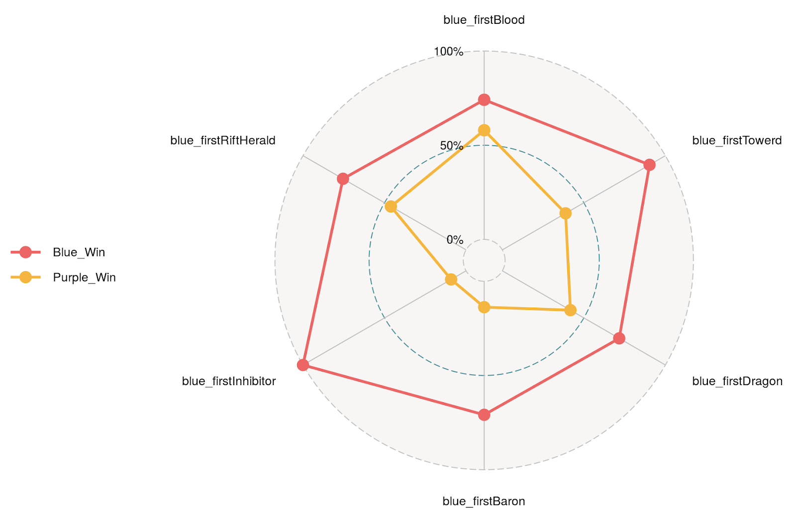
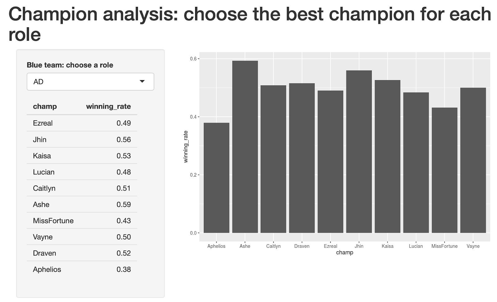
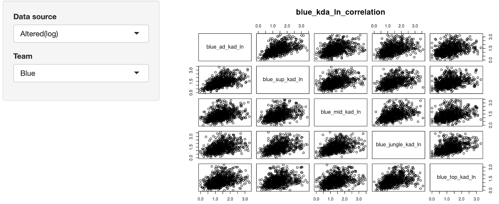
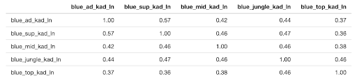
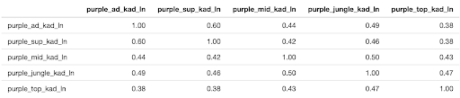

# League of Legends - Analysis and Prediction

### Group Members
* 106306032 資管四 楊存濬
* 106306069 資管四 汪君儫
* 106306076 資管四 謝采辰
* 108304056 統計二 陳岷逸

### Goals
* What are the important factors in a League of Lengends match to win?
* What champions should I choose for a higher winning rate?
* How is the relation of KDA (Kill, Death, Assist) between different roles in a match?
* Use the dataset to train model in order to predict the League of Legends match outcome.

### Demo 

```R
Rscript code/your_script.R --data data/training --output results/performance.csv
```
* Online Reactive Visual Graphs via Shiny
* [Link to Shiny Demo](https://tsai00150.shinyapps.io/League-of-Legend-Analysis-and-Prediction/)



#
## Folder organization and its related information
#
### Docs
*  --------------------- PUT PPT HERE ------------------------------
#
### Data
* Source:
	* Take data integrity and consistency into account, we believe that professional players will have more stable performance in games. So we select active professional players in North America teams as targets of analysis, and crawl data of recent 100 matches of each player via “Riot developer API”. 

* Input Format:
	* Excel file format - (921 obs. of 320 variables)
	* Attribute Information:

		* KDA = (kill+assist) / (death)
		1. blue_ad_kda 
		2.  blue_sup_kda 
		3. blue_mid_kda 
		4. blue_jungle_kda
		5. blue_top_kda
		6. firstBaron
		7. firstInhibitor
		8. firstTower
* Further Data Analysis: 
	
	In Champion, we provide User to query the winning rate of the top 10 champion in each position of blue and purple.
	
	In KDA, we observed the player's KDA (kill+assist) / (death).We found that the KDA data has the characteristics of left-biased peaks, so the data +1 is taken as a new feature that can be considered.
	
	
	From the data, we can see that the correlation between support and ADC is high, while the correlation between top and other teammates KDA is low. However, there is no obvious correlation between each other. 


* Data Preprocessing: 
  * No missing data
  * In the beginning, we use covariance matrix to do the PCA, but the Scree-plots suggest that using a covariance matrix is not the correct approach for calculating the principal components.
  * We chose correlation matrix to try again
#
### Code

* Which method do you use?
	* Decision Tree
	* Naive Bayes
	* Random Forest
	* Support Vector Machine (SVM)

* What is a null model for comparison?
	* blue team win 0.5103149
	* purple team win 0.4896851
	* Assume blue team wins every match

* How do your perform evaluation?
	* Cross-validation
	* Accuracy
	* Area Under Curve (AUC)

#
### Results
*  Which metrics did you use? 
	* ------------------ ADD METRICS USED ---------------------------
	* Decision tree: ??
	* Naive Bayes: ??
	* Random forest: ??
	* Svm: ??

* Is your improvement significant?
	* Yes, ------------------ NEEDS UPDATE -----------------------

* What is the challenging part of your project?
	* Our data mainly uses the data from the professional players, so the condition and mindset might be different from casual players.
	* Might require more features to make even more precise predicitonsin the future.
	* The limitation of data being able to aquire due to League of Legends official website.

#
## Reference
#
* [Reference 1](https://shiny.rstudio.com/tutorial/)
* [Reference 2](https://developer.riotgames.com/)
* [Reference 3](https://www.rdocumentation.org/packages/rpart/versions/4.1-15/topics/rpart)
* [Reference 4](https://www.rdocumentation.org/packages/e1071/versions/1.7-3/topics/naiveBayes)
* [Reference 5](https://www.rdocumentation.org/packages/stats/versions/3.6.2/topics/glm)
* [Reference 6](https://www.rdocumentation.org/packages/randomForest/versions/4.6-14/topics/randomForest)
* [Reference 7](https://www.rdocumentation.org/packages/e1071/versions/1.7-4/topics/svm)
##
* Packages you used:
	* openxlsx
	* corrplot
	* caret
	* rpart
	* ROCR
	* e1071
	* randomForest
	* class
	* ggplot2
	* ggradar
	* scales
	* dplyr
	* tibble
	* shiny
